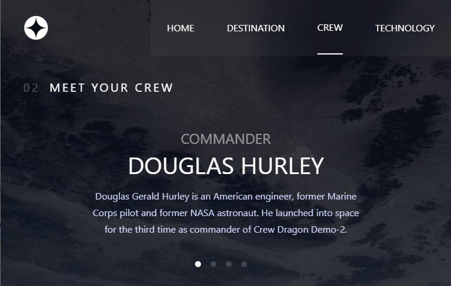

# Frontend Mentor - Space tourism website solution

This is a solution to the [Space tourism website challenge on Frontend Mentor](https://www.frontendmentor.io/challenges/space-tourism-multipage-website-gRWj1URZ3). Frontend Mentor challenges help you improve your coding skills by building realistic projects.

## Table of contents

- [Overview](#overview)
  - [The challenge](#the-challenge)
  - [Screenshot](#screenshot)
  - [Links](#links)
- [My process](#my-process)
  - [Built with](#built-with)
  - [Continued development](#continued-development)
  - [Useful resources](#useful-resources)
- [Author](#author)

## Overview

### The challenge

Users should be able to:

- View the optimal layout for each of the website's pages depending on their device's screen size
- See hover states for all interactive elements on the page
- View each page and be able to toggle between the tabs to see new information

### Screenshot

### Links

- Solution URL: [Click Here to see the solution](https://www.frontendmentor.io/solutions/a-responsive-space-tourism-website-using-reactjs-and-tailwindcss-rkNuaJBEc)
- Live Site URL: [Click here to see the live site](https://spacetourismwebs.netlify.app/)

## My process

### Built with

- Semantic HTML5 markup
- CSS custom properties
- Flexbox
- Mobile-first workflow
- [Tailwindcss](https://tailwindcss.com/) - CSS Framework
- [React](https://reactjs.org/) - JS library
- [Redux](https://redux.js.org/) - JS library
- [Axios](https://axios-http.com/) - React framework
- [React-Router-Dom](https://github.com/remix-run/react-router) - React framework

### Continued development

Since this is the third projects that I created using Reactjs and Tailwindcss, maybe for the next project I would like to try out Typescript to build a project. Or React Typescript would be fun too.

### Useful resources

- [How to get user width dynamicly](https://www.jsdiaries.com/how-to-get-the-width-of-the-window-in-react-js/) - This helped me for to get the windows width. The documentation about the code is very clear.

## Author

- Frontend Mentor - [@hermawangan](https://www.frontendmentor.io/profile/hermawangan)
- Twitter - [@hermawangan](https://twitter.com/hermawangan39)
- LinkedIn - [@hermawangan](https://www.linkedin.com/in/hermawan-gan/)
